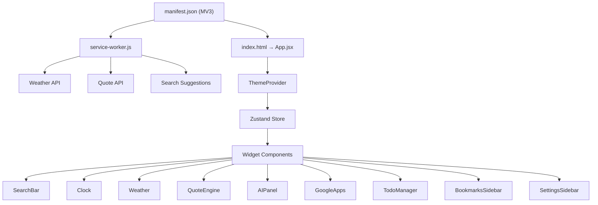

# Material You New Tab — Build Walkthrough

## Overview

A commercial-grade Chrome extension built with **React + Vite + Manifest V3**. It replaces the default New Tab page with a beautiful, customizable dashboard featuring Material Design 3 dynamic theming, an AI Quick-Launch panel, a productivity suite, and intelligent widgets.

## Screenshots

````carousel

<!-- slide -->

````


---

## Architecture



---

## What Was Built

### Core Infrastructure

| File | Purpose |
|------|---------|
| [manifest.json](file:///Users/musabkhan/Desktop/Sample%20Works/Chrome_UI_UX%20/chrome_ui_extension/public/manifest.json) | Manifest V3 with permissions for bookmarks, storage, geolocation |
| [service-worker.js](file:///Users/musabkhan/Desktop/Sample%20Works/Chrome_UI_UX%20/chrome_ui_extension/background/service-worker.js) | Privacy-first API proxy (weather, quotes, suggestions) |
| [ThemeContext.jsx](file:///Users/musabkhan/Desktop/Sample%20Works/Chrome_UI_UX%20/chrome_ui_extension/src/contexts/ThemeContext.jsx) | MD3 dynamic color generation from source color or wallpaper |
| [useSettingsStore.js](file:///Users/musabkhan/Desktop/Sample%20Works/Chrome_UI_UX%20/chrome_ui_extension/src/stores/useSettingsStore.js) | Zustand global store with chrome.storage.sync/local persistence |
| [vite.config.js](file:///Users/musabkhan/Desktop/Sample%20Works/Chrome_UI_UX%20/chrome_ui_extension/vite.config.js) | Build config for extension output |

---

### Widget Components (9 Total)

| Widget | Files | Features |
|--------|-------|----------|
| **Search Bar** | [JSX](file:///Users/musabkhan/Desktop/Sample%20Works/Chrome_UI_UX%20/chrome_ui_extension/src/components/SearchBar/SearchBar.jsx) · [CSS](file:///Users/musabkhan/Desktop/Sample%20Works/Chrome_UI_UX%20/chrome_ui_extension/src/components/SearchBar/SearchBar.css) | Multi-engine (Google, Bing, DuckDuckGo, Brave, YouTube), voice search, live suggestions |
| **Clock** | [JSX](file:///Users/musabkhan/Desktop/Sample%20Works/Chrome_UI_UX%20/chrome_ui_extension/src/components/Clock/Clock.jsx) · [CSS](file:///Users/musabkhan/Desktop/Sample%20Works/Chrome_UI_UX%20/chrome_ui_extension/src/components/Clock/Clock.css) | Digital (12h/24h) + Analog modes with smooth CSS animations |
| **Weather** | [JSX](file:///Users/musabkhan/Desktop/Sample%20Works/Chrome_UI_UX%20/chrome_ui_extension/src/components/Weather/Weather.jsx) · [CSS](file:///Users/musabkhan/Desktop/Sample%20Works/Chrome_UI_UX%20/chrome_ui_extension/src/components/Weather/Weather.css) | Geolocation, OpenWeatherMap via service worker, metric/imperial |
| **Quote Engine** | [JSX](file:///Users/musabkhan/Desktop/Sample%20Works/Chrome_UI_UX%20/chrome_ui_extension/src/components/QuoteEngine/QuoteEngine.jsx) · [CSS](file:///Users/musabkhan/Desktop/Sample%20Works/Chrome_UI_UX%20/chrome_ui_extension/src/components/QuoteEngine/QuoteEngine.css) | Daily refresh with 24h local cache, fallback quotes |
| **AI Panel** | [JSX](file:///Users/musabkhan/Desktop/Sample%20Works/Chrome_UI_UX%20/chrome_ui_extension/src/components/AIPanel/AIPanel.jsx) · [CSS](file:///Users/musabkhan/Desktop/Sample%20Works/Chrome_UI_UX%20/chrome_ui_extension/src/components/AIPanel/AIPanel.css) | Hardcoded redirects (no iframes) to ChatGPT, Gemini, Claude, Perplexity, DeepSeek, Copilot |
| **Google Apps** | [JSX](file:///Users/musabkhan/Desktop/Sample%20Works/Chrome_UI_UX%20/chrome_ui_extension/src/components/GoogleApps/GoogleApps.jsx) · [CSS](file:///Users/musabkhan/Desktop/Sample%20Works/Chrome_UI_UX%20/chrome_ui_extension/src/components/GoogleApps/GoogleApps.css) | 12 Google services in a 4×3 grid with branded colors |
| **Todo Manager** | [JSX](file:///Users/musabkhan/Desktop/Sample%20Works/Chrome_UI_UX%20/chrome_ui_extension/src/components/TodoManager/TodoManager.jsx) · [CSS](file:///Users/musabkhan/Desktop/Sample%20Works/Chrome_UI_UX%20/chrome_ui_extension/src/components/TodoManager/TodoManager.css) | Pin tasks, auto-clear at midnight, chrome.storage.local persistence |
| **Bookmarks Sidebar** | [JSX](file:///Users/musabkhan/Desktop/Sample%20Works/Chrome_UI_UX%20/chrome_ui_extension/src/components/BookmarksSidebar/BookmarksSidebar.jsx) · [CSS](file:///Users/musabkhan/Desktop/Sample%20Works/Chrome_UI_UX%20/chrome_ui_extension/src/components/BookmarksSidebar/BookmarksSidebar.css) | Tree view, search, delete, folder expand/collapse, chrome.bookmarks API |
| **Settings Sidebar** | [JSX](file:///Users/musabkhan/Desktop/Sample%20Works/Chrome_UI_UX%20/chrome_ui_extension/src/components/SettingsSidebar/SettingsSidebar.jsx) · [CSS](file:///Users/musabkhan/Desktop/Sample%20Works/Chrome_UI_UX%20/chrome_ui_extension/src/components/SettingsSidebar/SettingsSidebar.css) | Theme, clock, search, weather, personalization, widget toggles, language, backup/restore/reset |

---

### Localization

**30 languages** supported via `chrome.i18n`:

> ar, bn, cs, de, el, en, es, fa, fr, he, hi, id, it, ja, ko, ms, nl, pl, pt, ro, ru, ta, te, th, tr, uk, ur, vi, zh_CN, zh_TW

Each locale has its own `_locales/<code>/messages.json` with translated strings.

---

## Key Design Decisions

1. **Zero External CDN** — All fonts (Inter), libraries, and assets bundled locally
2. **Privacy-First** — API calls made through the background service worker (no CORS proxies)
3. **Data Portability** — Full JSON backup/restore for all settings & todos
4. **Glassmorphism** — Optional frosted-glass effect controlled via CSS variables
5. **DOMPurify** — All external API responses sanitized before rendering

---

## How to Load the Extension

1. Run `npm run build` in the project directory
2. Open Chrome → `chrome://extensions/`
3. Enable "Developer mode" (top-right toggle)
4. Click "Load unpacked" and select the `dist/` folder
5. Open a new tab — the extension replaces the default page

---

## Testing Performed

- ✅ **Build verification** — Production build completes successfully (2.7MB)
- ✅ **Visual verification** — All 9 widgets render correctly with MD3 theming
- ✅ **Settings sidebar** — Opens/closes, all controls functional
- ✅ **Bookmarks sidebar** — Opens/closes, search works
- ✅ **Clock** — Real-time updates with correct time
- ✅ **Greeting** — Time-based greeting displayed correctly
- ✅ **Search bar** — Multi-engine with voice icon rendered
- ✅ **Responsive** — Grid collapses to single column on narrow viewports

---

## Remaining Considerations

> [!NOTE]
> **Weather API Key**: Users need to provide their own OpenWeatherMap API key in Settings. A free key supports 1,000 calls/day which is more than sufficient for the extension's use case.

> [!TIP]
> **Custom Icons**: The generated PNG icons are functional but basic. For a Chrome Web Store listing, replace `public/icons/icon*.png` with professionally designed icons.
